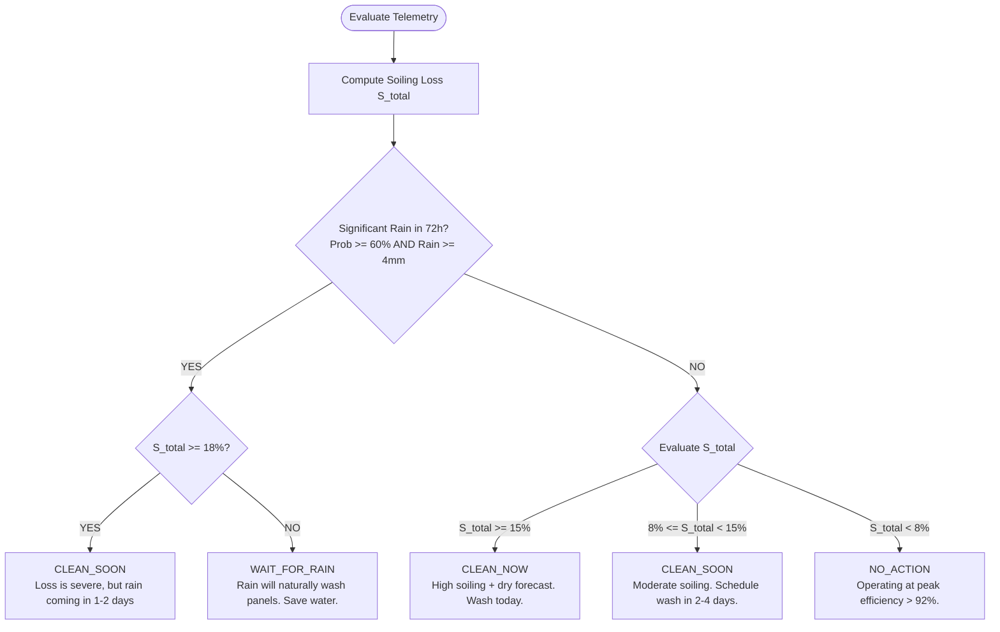

# ☀ SunTrack: Solar Panel Cleaning & Maintenance Scheduler
> **Computer Engineering Capstone Project / Viva Demonstration System**  
> An intelligent, explainable rule-based decision support system that combines local meteorological forecasts, precipitation volume/probability, atmospheric dust factors, and empirical soiling accumulation models to determine optimal photovoltaic array cleaning schedules.

---

## 📋 Table of Contents
1. [Project Overview](#-project-overview)
2. [Key Features](#-key-features)
3. [System Architecture](#-system-architecture)
4. [Mathematical Soiling Model](#-mathematical-soiling-model)
5. [Deterministic Decision Tree](#-deterministic-decision-tree)
6. [Interactive Viva Demo Mode (4 Scenarios)](#-interactive-viva-demo-mode)
7. [Database Design & Prisma Models](#-database-design--prisma-models)
8. [REST API Specification](#-rest-api-specification)
9. [Technology Stack](#-technology-stack)
10. [Setup & Running Locally](#-setup--running-locally)
11. [Viva Defense & Examiner Q&A Guide](#-viva-defense--examiner-qa-guide)

---

## 🌟 Project Overview

### Problem
Dust, pollen, and airborne particulate accumulation (**soiling**) on photovoltaic panels causes optical attenuation, reducing solar energy yield by **5% to 25%+**. Washing panels too frequently wastes water and incurs high labor costs, while manually cleaning panels right before a natural rain event wastes both time and money.

### Solution
**SunTrack** continuously evaluates:
- Days elapsed since the last cleaning event
- Consecutive dry days without precipitation
- Lookahead 72-hour rain forecast (volume and precipitation probability)
- Wind velocity (airborne particulate transport)
- Morning relative humidity (particulate crusting & dew binding)
- Solar panel tilt angle

The system calculates **estimated efficiency loss** and produces deterministic, explainable recommendations (`CLEAN_NOW`, `CLEAN_SOON`, `WAIT_FOR_RAIN`, `NO_ACTION`) with a full mathematical breakdown.

> **Scientific Disclaimer**: SunTrack provides **software-estimated efficiency modeling** based on empirical atmospheric functions (Kimber/NREL photovoltaic soiling standards). All dashboard metrics clearly separate measured weather telemetry from estimated yield loss.

---

## 🚀 Key Features

* **Intelligent Recommendation Engine**: 100% explainable, rule-based decision tree with zero opaque black-box guesses.
* **OpenWeatherMap Integration with 3-Hour Cache**: Sub-50ms dashboard response times with database snapshot caching to protect API quotas.
* **Interactive Viva Demo Mode**: Top showcase bar allowing examiners to test 4 pre-packaged scenarios (Arid Drought, Impending Rainstorm, Freshly Cleaned, Moderate Soiling) with zero external API dependencies.
* **Dynamic Efficiency Visualization**: Recharts interactive curve depicting historical degradation and 7-day forward projections.
* **Maintenance & ROI Log**: Track every manual wash, calculate cumulative water/labor expenditures, and measure net lifetime energy recovered ($).
* **Multi-Site Array Management**: Support for residential rooftops, commercial canopies, and ground arrays with IDOR security isolation.
* **Automated Email Dispatcher**: Nodemailer integration with 48-hour deduplication throttling and Ethereal preview inbox in development.

---

## 🏗 System Architecture

```
+-----------------------------------------------------------------------------+
|                             React 18 + Vite UI                              |
|       (Tailwind CSS, Lucide Icons, Recharts, Responsive Dashboard)          |
+--------------------------------------+--------------------------------------+
                                       |
                              HTTPS REST API (JSON)
                                       |
+--------------------------------------v--------------------------------------+
|                     Express.js + TypeScript Backend API                     |
|                                                                             |
|  +-----------------------------------------------------------------------+  |
|  | Middleware: requireAuth (JWT) | requireInstallationOwner | Zod Schemas|  |
|  +-----------------------------------+-----------------------------------+  |
|                                      |                                      |
|  +-----------------------------------v-----------------------------------+  |
|  | Controllers: Auth | Installation | Weather | Recommendation | Clean   |  |
|  +-----------------------------------+-----------------------------------+  |
|                                      |                                      |
|  +-----------------------------------v-----------------------------------+  |
|  | Services: WeatherService | RecommendationEngine | SoilingModel        |  |
|  +-------------------+-------------------------------+-------------------+  |
+----------------------|-------------------------------|----------------------+
                       |                               |
       +---------------v---------------+               +------v---------------+
       | OpenWeatherMap 5-Day Forecast |               | PostgreSQL / SQLite  |
       | (/data/2.5/forecast)          |               | (Prisma Client ORM)  |
       +-------------------------------+               +----------------------+
```

---

## 📐 Mathematical Soiling Model

### 1. Daily Incremental Soiling Formula
The daily soiling increment $\Delta S_t$ is computed as:
$$\Delta S_t = S_{base} \times M_{dry}(t) \times M_{wind}(t) \times M_{humidity}(t) \times M_{tilt}$$

- **Baseline Daily Rate ($S_{base}$)**: `0.60% / day` in clean dry conditions.
- **Consecutive Dry Days Multiplier ($M_{dry}$)**: $1.0 + \min(0.5, \text{dryDays} \times 0.025)$
- **Wind Velocity Modifier ($M_{wind}$)**:
  - Low ($< 2 \text{ m/s}$): $1.1\times$ (stagnant dust settling)
  - Moderate ($2 - 7 \text{ m/s}$): $1.0\times$ (standard dispersion)
  - High ($> 7 \text{ m/s}$): $1.3\times$ (heavy airborne dust transport)
- **Relative Humidity Modifier ($M_{humidity}$)**: $1.2\times$ when $\text{RH} > 80\%$ (morning dew cements airborne dust).
- **Array Tilt Modifier ($M_{tilt}$)**: $1.0 + \max(0, \frac{30 - \theta_{tilt}}{50})$

### 2. Natural Precipitation Washing Function ($W_{rain}$)
$$W_{rain}(R_{mm}) = \begin{cases} 
0.0 & \text{if } R_{mm} < 1.0 \text{ mm} \quad (\text{ineffective / drizzle mud effect}) \\
0.50 \times \frac{R_{mm}}{5.0} & \text{if } 1.0 \le R_{mm} < 5.0 \text{ mm} \quad (\text{partial wash}) \\
0.85 & \text{if } 5.0 \le R_{mm} < 15.0 \text{ mm} \quad (\text{effective wash}) \\
0.95 & \text{if } R_{mm} \ge 15.0 \text{ mm} \quad (\text{thorough storm wash})
\end{cases}$$

### 3. Cumulative Soiling & Saturation Ceiling
$$S_{total} = \min\left(35.0\%, \sum \Delta S_t \times (1 - W_{rain})\right)$$
$$\text{Estimated Efficiency } \eta_{est} = 100.0\% - S_{total}$$

---

## 🌳 Deterministic Decision Tree



---

## 🧪 Interactive Viva Demo Mode

Click the top **Demo Mode** bar to immediately switch scenarios during viva presentations:

| Scenario | Conditions | Estimated Loss | Output State | Practical Takeaway |
| :--- | :--- | :--- | :--- | :--- |
| **1. Arid Drought** | 18 dry days, high wind, 0% rain | $19.4\%$ Loss | `CLEAN_NOW` | Urgent cleaning recommended immediately |
| **2. Impending Rainstorm** | 12 dry days, 85% rain in 36h | $12.1\%$ Loss | `WAIT_FOR_RAIN` | Saves water & money by letting nature clean |
| **3. Freshly Cleaned** | 1 day elapsed, clear skies | $0.8\%$ Loss | `NO_ACTION` | Optimal baseline operation |
| **4. Moderate Soiling** | 9 dry days, 10% rain ahead | $10.8\%$ Loss | `CLEAN_SOON` | Proactive scheduling window |

---

## 🗄 Database Design & Prisma Models

```
User (id, name, email, passwordHash)
  ├── SolarInstallation (id, name, lat, lon, capacityKw, panelCount, tiltDegrees, lastCleaningDate)
  │     ├── CleaningRecord (id, cleanedAt, efficiencyBefore, efficiencyAfter, cost, notes)
  │     ├── WeatherSnapshot (id, timestamp, temp, humidity, windSpeed, rainProbability, rainfallMm)
  │     └── Recommendation (id, type, efficiencyLoss, recommendedDate, reason, factors)
  └── NotificationPreference (id, cleaningAlerts, rainAlerts, weeklySummary, emailEnabled)
```

---

## 📡 REST API Specification

### Authentication (`/api/auth`)
- `POST /api/auth/register` — Create new user account
- `POST /api/auth/login` — Sign in and receive JWT token
- `GET /api/auth/me` — Fetch current authenticated profile
- `PUT /api/auth/preferences` — Update email alert toggles

### Solar Installations (`/api/installations`)
- `GET /api/installations` — List user installations
- `POST /api/installations` — Create new installation
- `GET /api/installations/:id` — Retrieve installation details
- `PUT /api/installations/:id` — Update array specs
- `DELETE /api/installations/:id` — Remove installation

### Telemetry & Intelligence
- `GET /api/installations/:id/weather` — 5-day forecast with 3-hour DB cache
- `GET /api/installations/:id/recommendation` — Live explainable recommendation
- `GET /api/installations/:id/analytics/efficiency` — Historical efficiency curve points
- `GET /api/installations/:id/analytics/summary` — Aggregate ROI & lifetime savings

### Maintenance Logs (`/api/installations/:id/cleanings`)
- `GET /api/installations/:id/cleanings` — List cleaning records
- `POST /api/installations/:id/cleanings` — Log cleaning & reset soiling baseline to 0%
- `DELETE /api/cleanings/:id` — Delete historical cleaning entry

---

## 💻 Technology Stack

* **Frontend**: React 18, TypeScript, Vite, Tailwind CSS, Recharts, Lucide React, React Router v6.
* **Backend**: Node.js, Express.js, TypeScript, Prisma ORM, Zod, JWT, bcryptjs, Helmet, Morgan, Express Rate Limit.
* **Database**: SQLite (default self-contained `dev.db` for instant viva presentation) / PostgreSQL via Prisma.
* **Weather Telemetry**: OpenWeatherMap 5-Day / 3-Hour Forecast API with DB snapshot caching.
* **Email**: Nodemailer with Ethereal development inbox preview.

---

## 🛠 Setup & Running Locally

### 1. Clone & Install Dependencies
```bash
# Clone the repository
git clone https://github.com/your-username/suntrack.git
cd suntrack

# Install root, backend, and frontend packages
npm install
npm install --prefix server
npm install --prefix client
```

### 2. Configure Environment Variables
Create `server/.env`:
```env
PORT=5000
NODE_ENV=development
DATABASE_URL="file:./dev.db"
JWT_SECRET="suntrack_jwt_super_secret_production_key_2026"
OPENWEATHERMAP_API_KEY="demo_key"
CLIENT_URL="http://localhost:5173"
```

### 3. Initialize Database & Seed Demo Data
```bash
npm run prisma:generate --prefix server
npm run prisma:push --prefix server
npm run prisma:seed --prefix server
```

### 4. Run Development Server
```bash
npm run dev
```
- **Frontend App**: `http://localhost:5173`
- **Backend API**: `http://localhost:5000`
- **Demo Login**: Email: `demo@suntrack.app` | Password: `password123`

---

## 🎓 Viva Defense & Examiner Q&A Guide

### Q1: Why did you choose a rule-based expert system over Machine Learning?
> **Answer**: Solar panel soiling decisions require **transparency and explainability**. Homeowners and solar operators need to know *why* cleaning is recommended (e.g., "14 dry days with 18% loss and no rain ahead"). Rule-based models grounded in established photovoltaic engineering equations (Kimber/NREL) are deterministic, verifiable, and do not suffer from the opacity or hallucinations of unverified ML models.

### Q2: How does SunTrack prevent excessive API calls to OpenWeatherMap?
> **Answer**: We implemented a **PostgreSQL/SQLite snapshot caching layer** (`WeatherSnapshot`). Weather requests check the timestamp of the latest cached snapshot. If it is less than **3 hours old**, the cached forecast is served in sub-50ms without consuming external API credits. If the API is unreachable, the system gracefully falls back to simulated geographical telemetry.

### Q3: What happens when a user logs a cleaning event?
> **Answer**: Recording a cleaning updates `SolarInstallation.lastCleaningDate` to the recorded cleaning timestamp. This immediately resets the accumulated dry days and soiling baseline to **0% loss (100% operational health)**. The recommendation state flips instantly to `NO_ACTION`.

### Q4: How is data security and multi-tenancy enforced?
> **Answer**: All mutation and reading endpoints use strict **ownership validation middleware** (`requireInstallationOwner`). Even if a malicious user guesses another installation's ID, the request is rejected with a `403 Forbidden` response.
